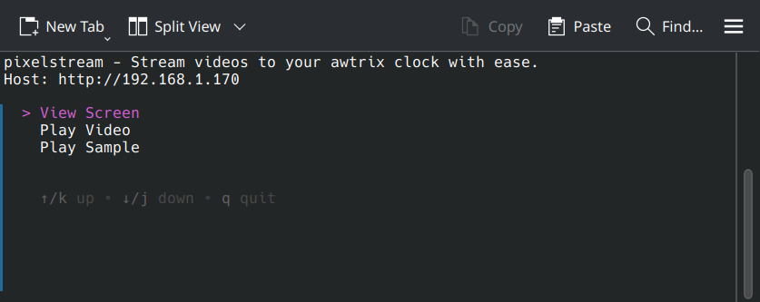
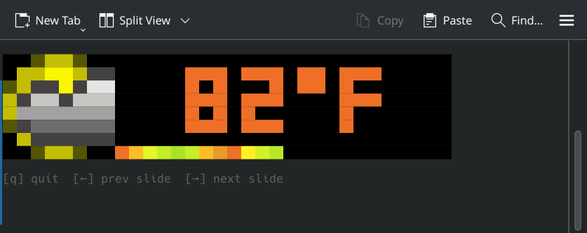
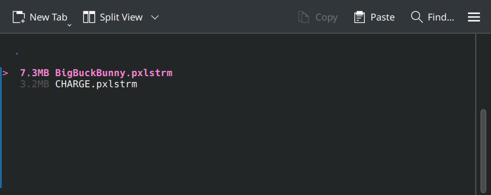
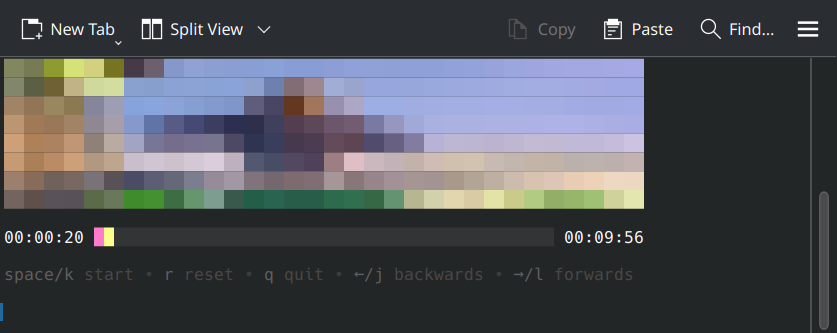
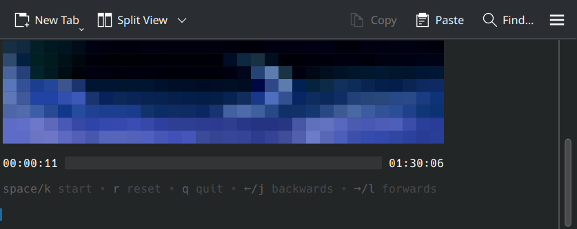

# pixelstream

Stream videos to your [awtrix](https://github.com/Blueforcer/awtrix3) clock with ease.

## Usage

pixelstream is a TUI (terminal user interface) application that can stream any video or movie to your awtrix clock and has built in media controls for pausing, playing, and seeking the video. As a bonus, you can also use it to view your clock's screen and change the current slide. [ffmpeg](https://ffmpeg.org/) is required in order for video conversions to work.

In order to start the application, you'll need to call the `pixelstream` executable with the host (ip address and protocol) of your clock as the argument:

```bash
pixelstream http://192.168.1.170
```

Once you've started the app, you'll see a menu with options to "View Screen", "Play Video", and "Play Sample":



If you click "View Screen", you'll be able to see what your clock is currently displaying and be able to go to the next/previous slides:



If you click "Play Video", you can choose any video file from your system that you want to stream to the clock. Likewise, for the "Play Sample" button, you can select any of the built-in, pre-converted, files to stream:



If you have not played a specific file before, pixelstream will use ffmpeg to convert it to a usable format, this could take anywhere between a few minutes to half an hour depending on the duration and resolution of the original file and your system resources. Once the conversion is complete, it will save to a new file with `.pxlstrm` at the end, this will make it so it doesn't have to convert the same file again in the future.

Once the file is loaded (and converted if necessary), the video will start playing in your terminal screen and stream to your clock as well. It comes with media controls for pausing/playing the video (space key), and for seeking (left & right arrows).




